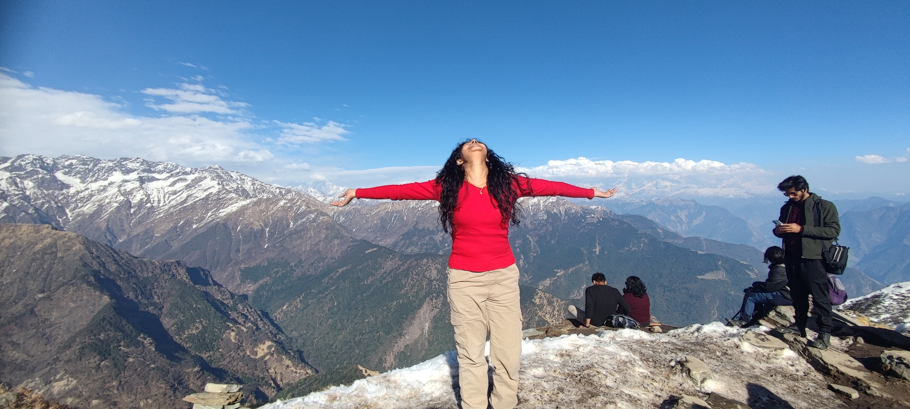
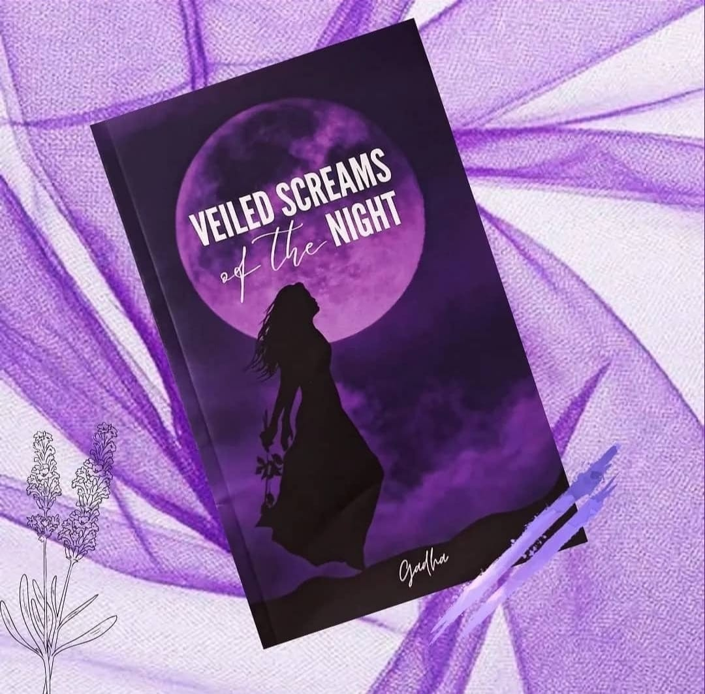
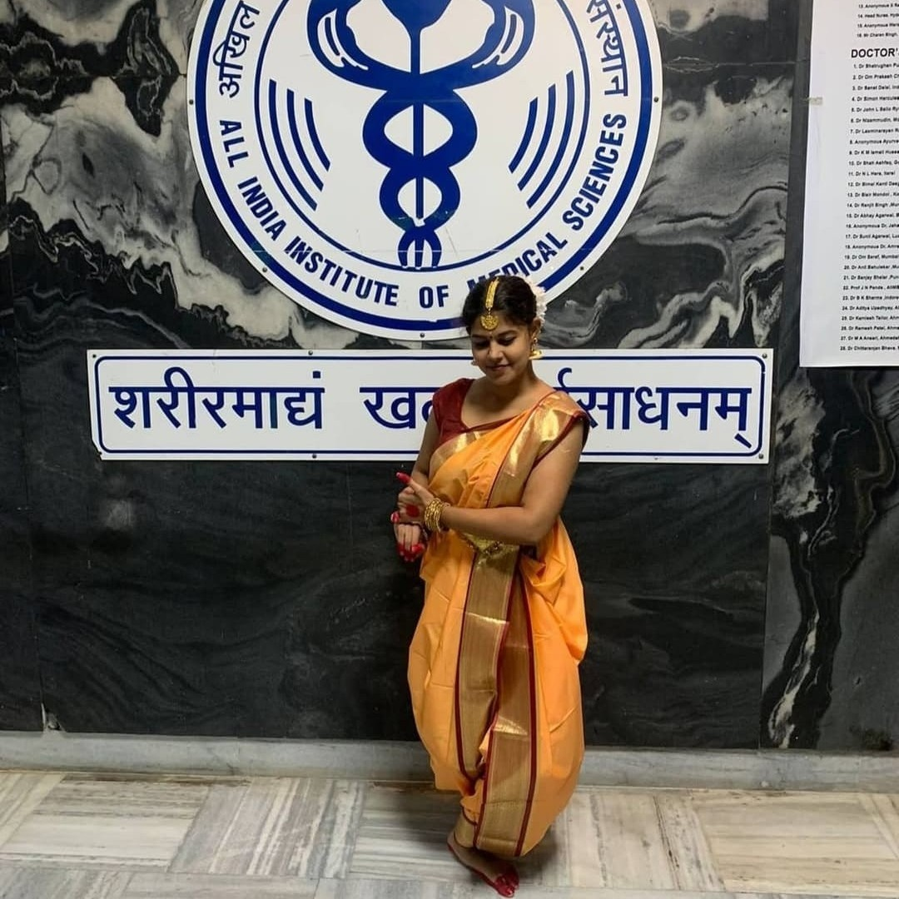
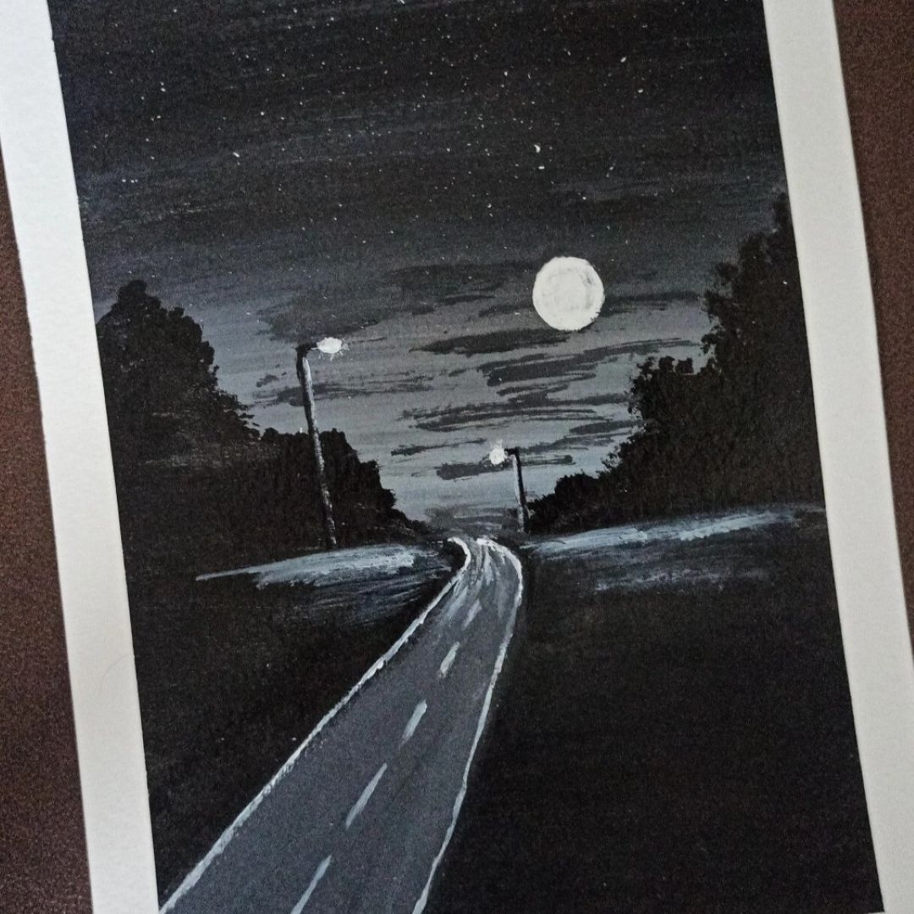

## <i class="bi bi-award"></i> Certifications & Training

::: {.grid}

::: {.g-col-12 .g-col-md-6}
#### Bioinformatics & Genomics

* **NASA GeneLab** | *GL4U: RNA Sequencing Module Set*
  * *Completed:* Aug 2025

* **NASA GeneLab** | *GL4U: Introduction Module Set*
  * *Completed:* July 2025

* **Genetic Counseling Certification**
  * *IMAeVarsity & Martin Luther Christian University*

:::

::: {.g-col-12 .g-col-md-6}
#### Wet Lab Techniques

* **Engineering Zebrafish with CRISPR Tools**
  * *CSIR-CCMB* | March 2020

* **Animal Cell Culture Techniques**
  * *CellKraft Biotech Pvt. Ltd* | Feb 2020

#### National Qualifications

* **JGEEBILS 2021** | Qualified (Ref: GS2021BIOPHD030224)
* **GATE 2020 (Life Sciences)** | AIR 1289 (Score: 475)

:::

:::

---

## <i class="bi bi-brush"></i> Creative Pursuits

### "Veiled Screams of the Night"
*Published Poetry Collection*

[View Book](https://www.amazon.in/VEILED-SCREAMS-NIGHT-Gadha/dp/1005519978){target="_blank" style="text-decoration: none; font-weight: bold; color: #6a4c93;"}

---

### Hobbies & Gallery
When I am not debugging R code or running experiments, I recharge through the arts and nature.

* <i class="bi bi-book"></i> Reading & Writing
* <i class="bi bi-music-note-beamed"></i> Violin
* <i class="bi bi-stars"></i> Classical Dance
* <i class="bi bi-palette"></i> Painting & Crochet

 

{style="width: 80%; max-width: 600px; height: auto; border-radius: 12px; box-shadow: 0 4px 10px rgba(0,0,0,0.15); margin-bottom: 30px;"}

::: {.grid}

::: {.g-col-12 .g-col-md-4}
{style="height: 40px; width: 100%; object-fit: cover; border-radius: 8px; box-shadow: 0 2px 4px rgba(0,0,0,0.1);"}
:::

::: {.g-col-12 .g-col-md-4}
{style="height: 40px; width: 100%; object-fit: cover; border-radius: 8px; box-shadow: 0 2px 4px rgba(0,0,0,0.1);"}
:::

::: {.g-col-12 .g-col-md-4}
{style="height: 40px; width: 100%; object-fit: cover; border-radius: 8px; box-shadow: 0 2px 4px rgba(0,0,0,0.1);"}
:::

:::